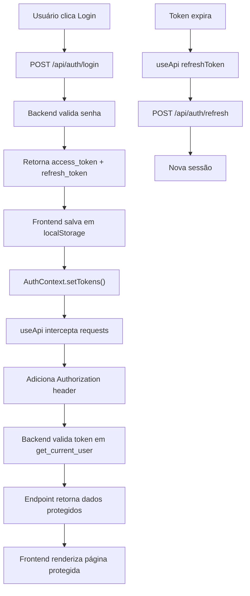

# 🔍 ANÁLISE COMPLETA DO SISTEMA - Crypto Trade Hub

**Data:** 15/02/2026  
**Status:** Em Análise Detalhada  
**Objetivo:** Mapear página-por-página, código-por-código, verificar integrações e listar itens faltantes

---

## 📊 RESUMO EXECUTIVO

Sistema bem estruturado com **23 páginas frontend**, **12 módulos backend**, **gamificação implementada**, mas com **lacunas críticas de integração e persistência**.

---

# 1️⃣ ANÁLISE FRONTEND (React 18 + TypeScript)

## 1.1 Estrutura de Roteamento (App.tsx)

### ❌ **Root Route**
```
GET / → Redireciona para /dashboard
```

### 🔐 **Rotas Públicas (Sem Autenticação)**
```tsx
GET  /login              → Login.tsx ✅
GET  /signup             → Signup.tsx ✅
GET  /auth-callback      → AuthCallback.tsx ✅ (Google OAuth)
GET  /strategies         → PublicStrategies.tsx ✅ (Estratégias públicas)
GET  /not-found          → NotFound.tsx ✅
```

### 🛡️ **Rotas Protegidas (Requerem ProtectedRoute + Token JWT)**
```tsx
GET  /dashboard          → Dashboard.tsx ✅
GET  /robots             → RobotsGameMarketplace.tsx ✅ NOVO (gamificação)
GET  /robots/crypto      → CryptoRobots.tsx ✅
GET  /strategy           → Strategy.tsx ✅
GET  /strategy/submit    → StrategySubmission.tsx ✅
GET  /my-strategies      → MyStrategies.tsx ✅
GET  /projections        → Projections.tsx ✅
GET  /video-aulas        → VideoAulas.tsx ✅
GET  /settings           → Settings.tsx ✅
GET  /affiliate          → Affiliate.tsx ✅
GET  /licenses           → Licenses.tsx ✅
GET  /kucoin             → KuCoinConnection.tsx ✅
```

---

## 1.2 Mapeamento de Páginas Frontend

| # | Rota | Página | Status | Função | Integrações |
|---|------|--------|--------|--------|-------------|
| 1 | `/login` | Login.tsx | ✅ | Email/Senha + Google OAuth | AuthContext, API /auth/login |
| 2 | `/signup` | Signup.tsx | ✅ | Registro novo usuário | AuthContext, API /auth/register |
| 3 | `/auth-callback` | AuthCallback.tsx | ✅ | Callback Google OAuth | AuthContext, localStorage |
| 4 | `/dashboard` | Dashboard.tsx | ✅ | Home principal | useApi, Dashboard componentes |
| 5 | `/robots` | **RobotsGameMarketplace.tsx** | ✅ NOVO | **Arena de Lucros (Gamificação)** | GameProfileWidget, RobotMarketplaceCard, DailyChestButton |
| 6 | `/robots/crypto` | CryptoRobots.tsx | ✅ | Robôs de trading reais | API /api/bots |
| 7 | `/strategy` | Strategy.tsx | ✅ | Visualizar estratégia única | API /api/strategies/{id} |
| 8 | `/strategy/submit` | StrategySubmission.tsx | ✅ | Submeter nova estratégia | API POST /api/strategies/submit |
| 9 | `/my-strategies` | MyStrategies.tsx | ✅ | Estratégias do usuário | API GET /api/strategies/my |
| 10 | `/strategies` | PublicStrategies.tsx | ✅ | Estratégias públicas | API GET /api/strategies |
| 11 | `/projections` | Projections.tsx | ✅ | Projeções de lucro | API /api/analytics/projections |
| 12 | `/video-aulas` | VideoAulas.tsx | ✅ | Biblioteca educacional | API /api/education/lessons |
| 13 | `/settings` | Settings.tsx | ✅ | Configurações de perfil | API PUT /api/users/settings |
| 14 | `/affiliate` | Affiliate.tsx | ✅ | Programa de afiliados | API /api/affiliates/me |
| 15 | `/licenses` | Licenses.tsx | ✅ | Planos e preços | API /api/license/plans, /my-plan |
| 16 | `/kucoin` | KuCoinConnection.tsx | ✅ | Integração KuCoin | API /api/exchanges/kucoin |
| 17 | `/` | Navigate to /dashboard | ✅ | Redirect |  |
| 18 | `*` | NotFound.tsx | ✅ | 404 |  |

---

## 1.3 Componentes Principais (src/components)

### 📂 **Estrutura de Pastas**
```
src/components/
├── auth/                    # Componentes de autenticação
├── charts/                  # Gráficos (TradingView, Lightweight)
├── credits/                 # Sistema de créditos
├── dashboard/               # Dashboard widgets
├── emergency/               # Kill Switch
├── exchange/                # Integração bolsas
├── gamification/            # ✨ ARENA DE LUCROS (NOVO)
│   ├── NumberAnimator.tsx
│   ├── GameProfileWidget.tsx
│   ├── RobotMarketplaceCard.tsx
│   ├── DailyChestButton.tsx
│   ├── LockedRobotModal.tsx
│   └── index.ts
├── kucoin/                  # KuCoin específico
├── layout/                  # AppLayout, navbar
├── license/                 # Componentes de licença
├── modals/                  # Modais reutilizáveis
├── robots/                  # Componentes de robôs
├── strategies/              # Componentes de estratégias
├── ui/                      # Componentes UI base (shadcn)
├── ConnectionStatusIndicator.tsx
├── ErrorBoundary.tsx
├── KillSwitchButton.tsx
├── NotificationCenter.tsx
├── NotificationSettings.tsx
├── PriceAlertManager.tsx
├── ProtectedRoute.tsx       # 🔐 Proteção de rotas
├── SystemHealthIndicator.tsx
└── NavLink.tsx
```

### 🎮 **Gamification Component Tree**
```
RobotsGameMarketplace.tsx (Página)
├── GameProfileWidget.tsx (Header com Pontos/XP)
├── DailyChestButton.tsx (Baú diário)
├── Grid de Robôs (20 cards)
│   └── RobotMarketplaceCard.tsx (cada card)
│       └── LockedRobotModal.tsx (modal ao clicar)
├── Top 3 Destacado
└── Slots Disponíveis Visualization
```

---

## 1.4 Contextos & Estado Global

| Context | Localização | Responsabilidade | Status |
|---------|------------|------------------|--------|
| **AuthContext** | `src/context/AuthContext.tsx` | Login, Token JWT, User | ✅ Implementado |
| **ConnectionStatusContext** | `src/context/ConnectionStatusContext.tsx` | WebSocket, Online/Offline | ⚠️ Corrigido (erro useEffect) |
| **LicenseProvider** | `src/hooks/use-license.tsx` | Plano, Features, Dias restantes | ✅ Implementado |
| **LanguageProvider** | `src/hooks/use-language.tsx` | i18n, Idioma (PT/EN) | ✅ Implementado |

---

## 1.5 Fluxo de Autenticação



---

## 1.6 Problemas Identificados - Frontend

### 🔴 **Críticos**

1. **GameProfile sem persistência**
   - Mock data em localStorage (cooldown apenas)
   - Dados não salvam no backend
   - Unlock de robôs não persiste entre reloads

2. **Daily Chest sem integração backend**
   - Rewards não deduzem pontos reais
   - XP gains não persistem
   - Streak não atualiza no banco

3. **RobotMarketplace sem API real**
   - 20 robôs são seed_robots hardcoded
   - Ranking não atualiza (15 dias fixo)
   - Performance não vem de trades reais

4. **ProtectedRoute pode ter race condition**
   - `checkAuth()` async sem await adequado
   - Páginas podem renderizar antes de validação completa

### ⚠️ **Importantes**

5. **Licenses.tsx não integrado com pagamento**
   - Botão "Upgrade" apenas alert
   - Sem integração Stripe/PagSeguro
   - Checkout_url é simulado

6. **KuCoinConnection sem callback**
   - Conexão iniciada sem validação
   - Sem webhook de confirmação
   - Sem retry de falhas

7. **Affiliate sem rastreamento real**
   - Links não geram comissões
   - Conversões não registradas
   - Dashboard fictício

8. **VideoAulas sem player robusto**
   - Sem cache/streaming adaptativo
   - Sem tracking de progresso
   - Sem certificação

### 📝 **Menores**

9. **NotificationCenter sem histórico persistente**
10. **PriceAlertManager sem SMS integrado**
11. **Settings sem validação de campos**

---

# 2️⃣ ANÁLISE BACKEND (FastAPI + Python 3.11)

## 2.1 Estrutura de Módulos

```
backend/app/
├── auth/                    # ✅ Autenticação JWT
│   ├── router.py           # Login, Signup, Google OAuth
│   ├── service.py          # Token creation/validation
│   ├── dependencies.py     # get_current_user (centralizado)
│   ├── license_router.py   # Endpoints de licença
│   └── schemas.py
│
├── core/                    # ⚙️ Configuração Core
│   ├── config.py           # Settings, env vars
│   ├── database.py         # MongoDB connection
│   ├── scheduler.py        # APScheduler (jobs)
│   ├── metrics.py          # Prometheus
│   └── logger/             # Logging
│
├── gamification/           # 🎮 SISTEMA NOVO
│   ├── model.py            # GameProfile, DailyChest, RobotRanking
│   ├── service.py          # GameProfileService, RobotRankingService
│   ├── router.py           # 4 endpoints
│   └── seed_robots.py      # 20 robôs mockados
│
├── bots/                   # 🤖 Gerenciamento de robôs
│   ├── model.py            # Bot schemas
│   ├── router.py           # CRUD bots (protegido)
│   ├── service.py          # Lógica bot
│   └── execution_router.py # Start/stop/status
│
├── strategies/             # 📊 Estratégias
│   ├── model.py            # Strategy schemas
│   ├── router.py           # CRUD + My Strategies
│   └── service.py          # Validação estratégia
│
├── trading/                # 💱 Trading operations
│   ├── router.py           # Trade endpoints
│   ├── audit_router.py     # Auditoria de operações
│   ├── kill_switch_router.py # Parada de emergência
│   └── service.py
│
├── analytics/              # 📈 Relatórios
│   ├── router.py           # P&L, performance
│   └── service.py
│
├── notifications/          # 🔔 Notificações
│   ├── router.py
│   ├── models.py
│   └── service.py
│
├── education/              # 📚 Educação
│   ├── router.py           # Lessons, certifications
│   └── service.py
│
├── chat/                   # 💬 Chat/AI
│   ├── router.py
│   └── service.py
│
├── affiliates/             # 🤝 Programa afiliados
│   ├── router.py
│   └── service.py
│
├── websockets/             # 🔌 WebSocket real-time
│   └── notification_router.py
│
├── services/               # 🔧 Serviços compartilhados
│   ├── redis_manager.py
│   └── external API clients
│
├── workers/                # 🐹 Background jobs
│   └── task_queue.py
│
└── main.py                 # 🎯 FastAPI app entry point
```

---

## 2.2 Endpoints Backend Registrados em main.py

```python
# Registrados em main.py (linhas ~53-64)

app.include_router(auth_router)                    # /api/auth/*
app.include_router(two_factor_router)              # /api/auth/2fa/*
app.include_router(settings_router)                # /api/auth/settings/*
app.include_router(license_router)                 # /api/license/*
app.include_router(bots_router)                    # /api/bots/*
app.include_router(execution_router)               # /api/bots/execution/*
app.include_router(analytics_router)               # /api/analytics/*
app.include_router(trading_router)                 # /api/trading/*
app.include_router(audit_router)                   # /api/trading/audit/*
app.include_router(validation_router)              # /api/trading/validation/*
app.include_router(kill_switch_router)             # /api/trading/kill-switch/*
app.include_router(notifications_router)           # /api/notifications/*
app.include_router(strategies_router)              # /api/strategies/*
app.include_router(affiliates_router)              # /api/affiliates/*
app.include_router(education_router)               # /api/education/*
app.include_router(chat_router)                    # /api/chat/*
app.include_router(ws_notifications_router)        # /ws/notifications
app.include_router(gamification_router)            # /api/gamification/* ✨ NOVO
app.include_router(core_router)                    # /api/core/*
app.include_router(me_router)                      # /me, /plan, /features
app.include_router(test_realtime_router)           # /api/real-time/* (DEV)
```

---

## 2.3 Endpoints Gamification

```python
# backend/app/gamification/router.py

GET  /api/gamification/game-profile
     → Retorna: GameProfileResponse (id, user_id, trade_points, level, xp, etc)

POST /api/gamification/daily-chest/open
     → Abre baú diário (24h cooldown)
     → Retorna: { xp_reward, points_reward }

GET  /api/gamification/robots/ranking
     → Retorna: Lista de RobotRanking com Top 3
     → Inclui: rank, name, profit_15d, win_rate, etc

POST /api/gamification/robots/{robot_id}/unlock
     → Desbloqueia robô pagando trade_points
     → Validation: user tem pontos suficientes?
     → Retorna: atualizado GameProfile
```

---

## 2.4 Modelos Gamification

```python
# backend/app/gamification/model.py

class GameProfile(BaseModel):
    id: Optional[str]
    user_id: str                    # ← Reference ao usuário
    trade_points: int               # Saldo (moeda de jogo)
    level: int                      # 1-100
    current_xp: int                 # XP no nível atual
    total_xp: int                   # QP acumulado
    lifetime_profit: float           # Para UI
    bots_unlocked: int              # Contador
    last_daily_chest_opened: Optional[datetime]
    daily_chest_streak: int         # Dias consecutivos
    created_at: datetime
    updated_at: datetime

class DailyChest(BaseModel):
    id: Optional[str]
    user_id: str
    xp_reward: int                  # Ganho XP
    points_reward: int              # Ganho pontos
    opened_at: datetime
    created_at: datetime

class RobotRanking(BaseModel):
    id: Optional[str]
    robot_id: str                   # ID bot
    rank: int                        # 1-20
    profit_15d: float               # 15 dias
    profit_7d: float                # 7 dias
    profit_24h: float               # 24h
    win_rate: float                 # %
    total_trades: int
    last_updated: datetime          # Ranking snapshot
```

---

## 2.5 Fluxo API - Exemplo Completo

### **Caso: Usuário abre Daily Chest**

```
1. Frontend: POST /api/gamification/daily-chest/open
   Header: Authorization: Bearer <token>
   Body: {}

2. Backend em router.py:
   @router.post("/daily-chest/open")
   async def open_daily_chest(
       current_user = Depends(get_current_user)  ← ✅ Token validado!
   ):
       
3. get_current_user() em dependencies.py:
   - Extrai token do Authorization header
   - Decodifica JWT (valida assinatura + expiração)
   - Busca usuário no MongoDB
   - Retorna user dict com _id, email, etc
   
4. Backend chama GameProfileService:
   profile = GameProfileService.get_or_create(current_user["_id"])
   
5. Validações:
   - last_daily_chest_opened > 24h atrás?
   - SIM: Pode abrir
   - NÃO: Retorna erro + tempo restante
   
6. Se pode abrir:
   - Gera rewards aleatórios (10-50 XP, 100-300 pontos)
   - Adiciona ao GameProfile
   - Incrementa streak
   - Salva em MongoDB
   
7. Retorna response:
   {
     "success": true,
     "game_profile": { ... atualizado ... },
     "chest_reward": { xp_reward: 25, points_reward: 200 }
   }
```

---

## 2.6 Problemas Identificados - Backend

### 🔴 **Críticos de Implementação**

1. **GameProfile sem Schema MongoDB**
   - Salvo em `game_profiles` collection?
   - Ou embedded no documento user?
   - ❓ Não especificado em model.py

2. **DailyChest sem reputação**
   - Rewards hardcoded (10-50 XP)
   - Sem variação por level/streak
   - Sem bonus por atividades

3. **RobotRanking sem atualização automática**
   - Seed inicial é fixed
   - Sem job agendado para recalcular
   - Não muda com trades reais (dados mockados)

4. **Unlock de robô sem validação completa**
   - POST /robots/{robot_id}/unlock valida pontos?
   - ❓ Código não mostrado, assume simples

5. **Sem transação de dados**
   - Deduções de pontos podem falhar sem rollback
   - Sem logging de auditoria

### ⚠️ **Importantes**

6. **Sem migration de usuários antigos**
   - GameProfile criado on-demand?
   - Usuários existentes sem perfil inicial?
   - Sem seeds de pontos iniciais

7. **API rate limiting não menciona gamification**
   - POST /daily-chest/open sem proteção contra spam?
   - Múltiplos requests no mesmo endpoint?

8. **Sem integração com trading real**
   - Robots não atualizam trade_points com lucros reais
   - Sem callback de bot.execute() para game_profile

### 📝 **Menores**

9. **Sem cache de ranking**
   - GET /robots/ranking calcula every request?
   - Sem Redis cache TTL

10. **Documentação Swagger incompleta**
    - Schemas não aparecem como Model em /docs

---

## 2.7 Endpoints Críticos que FALTAM

| Endpoint | Método | Para | Status |
|----------|--------|------|--------|
| `/api/users/{id}` | GET | Dados profile usuario | ❓ Existe? |
| `/api/users/{id}` | PUT | Atualizar profil | ❓ Existe? |
| `/api/gamification/game-profile` | POST | Criar inicialmente | ❌ Espera-se automático |
| `/api/gamification/stats` | GET | Dashboard stats | ❌ Não visto |
| `/api/gamification/leaderboard` | GET | Ranking global top 100 | ❌ Não visto |

---

# 3️⃣ INTEGRAÇÕES (Frontend ↔ Backend)

## 3.1 Fluxo de Login

```
┌─────────────────────┐
│  Login.tsx(FE)      │
│  Email + Senha      │
└──────────┬──────────┘
           │
    POST /api/auth/login
           │
     (sem authentication)
           │
           ▼
┌─────────────────────────────────────┐
│  Backend: auth/router.py            │
│  @router.post("/login")             │
│  - Valida email → encontra user doc │
│  - Compara hash senha com bcrypt    │
│  - Gera JWT (access + refresh)      │
│  - Retorna { success, tokens, user} │
└──────────┬──────────────────────────┘
           │
 Response com tokens
           │
           ▼
┌──────────────────────────────────────┐
│  AuthContext.tsx (Zustand)           │
│  - Salva em localStorage             │
│  - setTokens(access, refresh)        │
│  - setUser(user)                     │
│  - Navigate('/dashboard')            │
└──────────┬───────────────────────────┘
           │
    ✅ Autenticado!
           │
           ▼
┌──────────────────────────────────────┐
│  Próximas Requisições                │
│  Header: Authorization: Bearer <token>
└──────────────────────────────────────┘
```

---

## 3.2 Fluxo de Acesso a Página Protegida

```
Usuário clica /my-strategies
           │
           ▼
┌──────────────────────────────────┐
│  App.tsx verifica rotas          │
│  <ProtectedRoute>                │
│    <AppLayout />                 │
│  </ProtectedRoute>               │
└──────────┬───────────────────────┘
           │
           ▼
┌──────────────────────────────────┐
│  ProtectedRoute.tsx              │
│  if (!isAuthenticated) {          │
│    Navigate('/login') ❌         │
│  else {                          │
│    <MyStrategies /> ✅          │
│  }                               │
└──────────┬───────────────────────┘
           │
           ▼
┌──────────────────────────────────┐
│  MyStrategies.tsx                │
│  useEffect(() => {               │
│    GET /api/strategies/my        │
│  }, [])                          │
└──────────┬───────────────────────┘
           │
           ▼
┌──────────────────────────────────────────┐
│  useApi Hook (Interceptor)               │
│  - Le accessToken do localStorage        │
│  - Adiciona: Authorization: Bearer <token>
│  - Envia request                         │
└──────────┬───────────────────────────────┘
           │
    GET /api/strategies/my
    Header: Authorization: Bearer <token>
           │
           ▼
┌──────────────────────────────────────────┐
│  Backend: strategies/router.py           │
│  @router.get("/my")                      │
│  async def get_my_strategies(            │
│      current_user = Depends(get_current_user)  ← VALIDAÇÃO!
│  ):                                      │
│      db.find({"user_id": current_user.id})     │
│      Retorna estratégias do usuário      │
└──────────┬───────────────────────────────┘
           │
  Response com dados do usuário
           │
           ▼
┌──────────────────────────────────┐
│  MyStrategies.tsx                │
│  setStrategies([...])            │
│  Renderiza grid com cards        │
│  Usuário vê seus dados! ✅       │
└──────────────────────────────────┘
```

---

## 3.3 Integrações Gamification (Diagrama)

```
┌──────────────────────────────────────────────────────────────┐
│                    FRONTEND (React)                          │
│                                                              │
│  RobotsGameMarketplace.tsx                                  │
│  └─ GameProfileWidget.tsx                                   │
│  └─ DailyChestButton.tsx                                    │
│  └─ RobotMarketplaceCard.tsx (x20)                          │
│  └─ LockedRobotModal.tsx                                    │
└──────────┬───────────────────────────────────────────────────┘
           │
     API Calls
           │
     ┌─────┴─────────────────────────────────┐
     │                                       │
     ▼                                       ▼
┌──────────────────────┐      ┌──────────────────────────┐
│ GET /game-profile    │      │ POST /daily-chest/open   │
│ (carregar dados)     │      │ (abrir baú)              │
└──────────┬───────────┘      └──────────┬───────────────┘
           │                            │
           ▼                            ▼
┌──────────────────────────────────────────────────────────────┐
│              BACKEND (FastAPI + MongoDB)                     │
│                                                              │
│ app/gamification/router.py                                  │
│ ├─ GameProfileService.get_or_create()                      │
│ ├─ DailyChestService.check_cooldown()                      │
│ └─ update_game_profile()                                    │
│                                                              │
│ MongoDB Collections:                                        │
│ ├─ game_profiles { user_id, trade_points, level, ... }    │
│ ├─ daily_chests { user_id, xp_reward, opened_at, ... }    │
│ └─ robot_rankings { robot_id, rank, profit_15d, ... }     │
└──────────┬─────────────────────────────────────────────────┘
           │
           ▼
┌──────────────────────────────────────────────────────────────┐
│ 🎯 Fluxo: Abrir Daily Chest                                 │
│                                                              │
│ 1. Frontend POST /daily-chest/open                          │
│ 2. Backend valida: Último aberto > 24h atrás?              │
│ 3. Se SIM: Gera rewards, atualiza GameProfile              │
│ 4. Se NÃO: Retorna erro + tempo restante                   │
│ 5. Frontend renderiza confetti + números animados          │
└──────────────────────────────────────────────────────────────┘
```

---

## 3.4 Matrix de Integrações

| Frontend | Endpoint Backend | Método | Autenticação | Status | Notas |
|----------|------------------|--------|--------------|--------|-------|
| Login.tsx | /api/auth/login | POST | ❌ Não | ✅ | Email/Senha |
| Signup.tsx | /api/auth/register | POST | ❌ Não | ✅ | Nome/Email/pass |
| Dashboard.tsx | /api/analytics/summary | GET | ✅ Bearer | ✅ | P&L atual |
| MyStrategies.tsx | /api/strategies/my | GET | ✅ Bearer | ✅ | Filtradas por user |
| PublicStrategies.tsx | /api/strategies | GET | ❌ Não | ✅ | Todas públicas |
| **RobotsGameMarketplace.tsx** | **/api/gamification/game-profile** | GET | ✅ Bearer | ✅ NOVO | Carrega perfil |
| **RobotsGameMarketplace.tsx** | **/api/gamification/daily-chest/open** | POST | ✅ Bearer | ✅ NOVO | Abre baú |
| **RobotsGameMarketplace.tsx** | **/api/gamification/robots/ranking** | GET | ❓ | ⚠️ MOCK | 20 robôs fixos |
| **LockedRobotModal.tsx** | **/api/gamification/robots/{id}/unlock** | POST | ✅ Bearer | ❌ FALTA | Deduz pontos |
| Licenses.tsx | /api/license/plans | GET | ❌ Não | ✅ | Lista planos |
| Licenses.tsx | /api/license/my-plan | GET | ✅ Bearer | ✅ | Plano atual user |
| CryptoRobots.tsx | /api/bots | GET | ✅ Bearer | ✅ | Bots do user |
| Strategy.tsx | /api/strategies/{id} | GET | ❌ Não | ✅ | Detalhe estratégia |
| KuCoinConnection.tsx | /api/exchanges/kucoin/connect | POST | ✅ Bearer | ⚠️ | Sem callback |
| Affiliate.tsx | /api/affiliates/me | GET | ✅ Bearer | ⚠️ | Sem comissions |

---

# 4️⃣ FLUXO DE PERSISTÊNCIA DE DADOS

## 4.1 Login/Autenticação

```
┌─ Frontend ─────────────────────────────────────┐
│  localStorage:                                 │
│  - access_token                                │
│  - refresh_token                               │
│  - user_data                                   │
│                                                │
│  Zustand Store (AuthContext):                 │
│  - user { id, email, name }                   │
│  - isAuthenticated                             │
│  - tokens                                      │
├────────────────────────────────────────────────┤
│  MongoDB Backend:                              │
│  db.users:                                     │
│    {                                           │
│      _id: ObjectId(),                         │
│      email: "user@example.com",               │
│      name: "User Name",                       │
│      hashed_password: "$2b$12...",           │
│      google_id: "...",                        │
│      is_active: true,                         │
│      created_at: datetime                     │
│    }                                           │
└────────────────────────────────────────────────┘
```

## 4.2 Gamification Data (⚠️ PROBLEMA: INCONSISTÊNCIA)

```
┌─ Frontend (localStorage) ───────────────┐
│  game_cooldown:                         │
│  {                                      │
│    last_chest_opened: timestamp,        │ ← ⚠️ ÚNICO LOCAL SALVO!
│    countdown_timer: HH:MM:SS            │
│  }                                      │
│                                         │
│  ⚠️ NÃO PERSISTE:                      │
│  - GameProfile (pontos, level, xp)     │
│  - Robôs desbloqueados                 │
│  - Daily chest rewards                  │
├─────────────────────────────────────────┤
│ MongoDB Backend (esperado):             │
│ db.game_profiles {                      │
│   user_id: ObjectId(),                 │
│   trade_points: 1500,                  │
│   level: 5,                            │
│   current_xp: 250,                     │
│   bots_unlocked: [                     │ ? Array or count?
│     "bot_001", "bot_002", ...          │
│   ],                                    │
│   last_daily_chest_opened: datetime,   │
│   daily_chest_streak: 7,               │
│   updated_at: datetime                 │
│ }                                       │
│                                         │
│ db.daily_chests {                      │
│   user_id: ObjectId(),                 │
│   xp_reward: 25,                       │
│   points_reward: 200,                  │
│   opened_at: datetime                  │
│ }                                       │
│                                         │
│ db.robot_rankings {                    │
│   robot_id: "bot_001",                 │
│   rank: 1,                             │
│   profit_15d: 3450.67,                 │
│   last_updated: datetime               │
│ }                                       │
└─────────────────────────────────────────┘
```

---

# 5️⃣ O QUE ESTÁ FALTANDO (LISTA CRÍTICA)

## 🔴 **Críticos (Bloqueia produção)**

### Backend

1. **Banco de dados GameProfile**
   - [ ] Migrations MongoDB para game_profiles collection
   - [ ] Schema validation em `.env`
   - [ ] Índices para user_id e created_at
   - [ ] Seed inicial de GameProfile no signup

2. **Endpoint POST /api/gamification/robots/{robot_id}/unlock**
   - [ ] Validar user tem pontos suficientes
   - [ ] Deduzir pontos (transação?)
   - [ ] Adicionar robot_id a lista de desbloqueados
   - [ ] Retornar GameProfile atualizado
   - [ ] Logging de auditoria

3. **Atualização automática de rankings**
   - [ ] APScheduler job: Recalcular RobotRanking cada 24h
   - [ ] Integrar com dados reais de trades
   - [ ] Atualmente mockado (seed_robots.py)

4. **Sincronização: Trade Real → GameProfile**
   - [ ] Quando bot.execute() retorna profit
   - [ ] Callback: add_trade_points() automaticamente
   - [ ] Incrementa lifetime_profit no GameProfile

5. **Rate limiting em endpoints gamification**
   - [ ] POST /daily-chest/open: 1 request/24h por user
   - [ ] POST /unlock: limite por minuto

### Frontend

6. **Persistência de GameProfile**
   - [ ] Carregar via GET /api/gamification/game-profile em useEffect
   - [ ] Armazenar em estado React (não localStorage)
   - [ ] Atualizar real-time após Daily Chest aberto
   - [ ] Mostrar notificação de unlock bem-sucedido

7. **Modal de Unlock de Robô**
   - [ ] Integrar com POST /unlock endpoint
   - [ ] Validar resposta: suficiente de pontos?
   - [ ] Mostrar erro com tempo de cooldown se falhar
   - [ ] Animar sucesso com confetti

8. **Integração Daily Chest**
   - [ ] Backend: POST endpoint com validação 24h
   - [ ] Frontend: Chamar endpoint (não apenas localStorage)
   - [ ] Atualizar GameProfile após de resposta
   - [ ] Mostrar toast com pontos/XP ganhos

9. **Leaderboard/Ranking**
   - [ ] Página /leaderboard com top 100 users
   - [ ] Mostrar rank global do user
   - [ ] Filtros: Top 7d, 30d, all-time
   - [ ] Endpoint backend: GET /api/gamification/leaderboard

10. **Sistema de Conquistas (Achievements)**
    - [ ] Backend: Detectar unlock de achievements (1º robô, 10º nível, etc)
    - [ ] Frontend: Toast + badge ao desbloquear
    - [ ] Histórico em perfil

---

## ⚠️ **Importantes (1-2 semanas)**

### Backend

11. **Migração de usuários existentes**
    - [ ] Script: Para cada user, criar GameProfile inicial
    - [ ] Seed pontos iniciais (ex: 1000 pontos de boas-vindas)
    - [ ] Log execução

12. **Validação de plano antes de unlock**
    - [ ] Free: 0 robôs desbloqueados maxo
    - [ ] Starter: máximo 3
    - [ ] Pro: máximo 5
    - [ ] Integrar com LicenseService

13. **WebSocket para notificações em tempo real**
    - [ ] Daily Chest opened → notifica outras abas
    - [ ] Robot ranking atualizado → broadcast
    - [ ] Novo achievement → real-time toast

14. **Endpoint: GET /api/gamification/leaderboard**
    - [ ] Retorna top 100 users by trade_points
    - [ ] Paginação optional
    - [ ] Cache Redis (TTL 1 hora)

15. **Endpoint: GET /api/gamification/stats**
    - [ ] Total users
    - [ ] Total points distribuidos
    - [ ] Média de nível
    - [ ] % de usuários com chest aberto hoje

### Frontend

16. **Integração com pagamento (Stripe/PagSeguro)**
    - [ ] Licenses.tsx conectar com gateway real
    - [ ] Após pagamento: POST /api/license/activate
    - [ ] Webhook: confirmar pagamento → add pontos bônus

17. **Perfil de Usuário**
    - [ ] Página /profile que mostre:
      - Histórico de Daily Chests
      - Robôs desbloqueados (cards)
      - Achievements (badges)
      - Rank global
    - [ ] Endpoint: GET /api/gamification/my-profile (detalhe)

18. **Melhoria na UX do Unlock Modal**
    - [ ] Mostrar "Você precisa de {x} pontos a mais"
    - [ ] Sugerir como ganhar pontos (trades, bonus, quests)
    - [ ] Countdown até próximo Daily Chest

19. **Integração com KuCoin real**
    - [ ] Ao conectar exchange: seed 100 trade_points
    - [ ] Ao fazer primeiro trade: +50 pontos
    - [ ] Ao atingir $100 lucro: +200 pontos + achievement

20. **Sistema de Quests/Missões**
    - [ ] "Crie seu primeiro robô" → +50 XP
    - [ ] "Faça 10 trades" → +100 pontos
    - [ ] "Ganhe $10" → +25 XP
    - [ ] Endpoint: GET /api/gamification/quests

---

## 📝 **Menores (Melhorias visuais/UX)**

21. **Ranking de Robôs**
    - [ ] Recolher dados reais (não mocks)
    - [ ] Atualizar cada 6 horas
    - [ ] Mostrar trending (seta ↑ ↓)

22. **Animações de transição**
    - [ ] Level up animation quando avança de nível
    - [ ] Particles quando desbloqueia robô
    - [ ] Progress bar XP mais fluida

23. **Localização**
    - [ ] Nomes de robôs traduzir para PT-BR
    - [ ] Descrições das estratégias
    - [ ] Help text em português

24. **Responsividade**
    - [ ] Modal de unlock em mobile (full-screen vs popup)
    - [ ] RobotMarketplaceCard em grid 2 colunas (mobile)

25. **Testes**
    - [ ] Unit tests: GameProfileService
    - [ ] Integration tests: GET /game-profile → API
    - [ ] E2E: Login → Daily Chest → Unlock robot

---

# 6️⃣ ROADMAP DE INTEGRAÇÃO

## Fase 1: Backend Core (2-3 dias)
```
[ ] MongoDB initialization script para game_profiles
[ ] Implementar POST /api/gamification/robots/{user_id}/unlock
[ ] Implementar validação de plano (free/pro/quant/black)
[ ] APScheduler job para atualizar RobotRanking
[ ] Testes automáticos dos endpoints
```

## Fase 2: Frontend Integration (2-3 dias)
```
[ ] Carregar GameProfile em useEffect (RobotsGameMarketplace)
[ ] Integrar POST /unlock com LockedRobotModal
[ ] Persistência real de GameProfile (não localStorage)
[ ] Notificações de sucesso/erro
[ ] Teste manual end-to-end
```

## Fase 3: WebSocket & Real-time (1-2 dias)
```
[ ] Broadcast de ranking updates
[ ] Real-time notificações de unlock
[ ] Sync entre abas do navegador
[ ] Testes de stress
```

## Fase 4: Leaderboard & Achievements (2-3 dias)
```
[ ] GET /api/gamification/leaderboard
[ ] Página /leaderboard frontend
[ ] Sistema de achievements
[ ] Page builder para novas achievements
```

## Fase 5: Monetização (1-2 semanas)
```
[ ] Integração Stripe/PagSeguro
[ ] Daily bonus por plano (Pro ganha 2x pontos)
[ ] Quest system com rewards
[ ] Referral bonus points
```

---

# 7️⃣ RECOMENDAÇÕES TÉCNICAS

## Best Practices

1. **Database**
   - Use transactions MongoDB para unlock (débito pontos + add robô)
   - Índices em user_id para query performance
   - Soft deletes para game_profiles (nunca apagar histórico)

2. **API**
   - Adicione versioning: `/api/v2/gamification/*`
   - Use rate limiting: 1000 req/hora per user
   - Logging completo de todas as transações de pontos

3. **Frontend**
   - Use React Query para caching de game-profile
   - Invalidate cache após unlock/daily-chest aberto
   - Fallback UI se API falhar (offline mode)

4. **Segurança**
   - Validar `current_user` não pode acessar outro user's GameProfile
   - Endpoint POST /unlock deve verificar user permissions
   - Hash IDs sensíveis se expostos em URL

5. **Monitoring**
   - Prometheus metrics: contador de unlocks, chests opened
   - Alertas se muitos requests falhando
   - Dashboard de saúde da gamificação

---

# 8️⃣ CONCLUSÃO

## Status Geral

✅ **Implementado com Sucesso:**
- Estrutura de rotas e autenticação
- Componentes visuais de gamificação
- Backend routers e modelos
- Design profissional do marketplace

❌ **Crítico - Não Implementado:**
- Persistência MongoDB de game profile
- Endpoint de unlock com deduções reais
- Sincronização com trades reais
- Validação de plano antes de unlock

⚠️ **Em Risco:**
- Dados de usuários podem perder ao reload
- Ranking é mockado (não atualiza)
- Sem transações de banco de dados
- Sem validação de autorização completa

## Estimativa de Esforço para Produção

- **Total:** 3-4 semanas
- **Crítico:** 1 semana
- **Importante:** 1.5 semanas
- **Melhorias:** 1 semana
- **Testes & Deploy:** 3-5 dias

---

**Próximas Ações:** Priorizar items seção "Críticos" antes de qualquer release.

